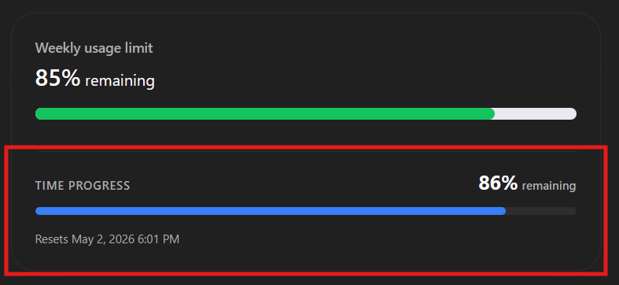

# Codex Usage Tracker 📊⏳

**Master your ChatGPT pacing with real-time time-progress visualization.**

## Overview

The **Codex Usage Tracker** is a lightweight Chrome extension designed for power users who want to stay on top of their ChatGPT message limits. While the native analytics page shows you *how many* messages you have left, this extension adds the missing context: **how much time is remaining in your cycle.**

By comparing your usage bar with the time progress bar, you can instantly see if you're on track to hit your limit early or if you have room to spare.

## Key Features

- **Dynamic Time Progress:** Adds a high-precision progress bar showing exactly where you are in your current reset window.
- **Smart Cycle Detection:** Automatically detects and adjusts for **Hourly**, **Daily**, and **Weekly** usage cycles.
- **At-a-Glance Pacing:** Compare usage vs. time instantly. If your green bar is further along than the blue bar, you're ahead of your pace!
- **Native Look & Feel:** Designed to match the OpenAI/ChatGPT design system perfectly for a seamless, professional experience.
- **Privacy-First:** Operates entirely locally. No data is collected, stored, or sent to any external servers.

## Installation

### From Chrome Web Store (Recommended)
*Coming Soon!*

### Manual Installation (Developer Mode)
1. Clone this repository or download the source code.
2. Open Chrome and navigate to `chrome://extensions/`.
3. Enable **Developer mode** (toggle in the top right).
4. Click **Load unpacked** and select the folder containing this project.
5. Navigate to your [ChatGPT Usage Analytics](https://chatgpt.com/codex/cloud/settings/analytics) page to see it in action!

## How it Works

The extension uses a `MutationObserver` to watch for the usage elements on the analytics page. It scrapes the "Resets" timestamp and the cycle type (Weekly/Daily/etc.) to calculate the percentage of time elapsed in your current window, injecting a custom UI element right above the reset text.

## Privacy & Security

We believe your usage habits are your business.
- **No Data Collection:** The extension does not collect any personal information.
- **Local Processing:** All calculations happen on your machine.
- **Minimal Permissions:** Only requires `storage` (for settings) and access to the specific ChatGPT analytics URL.

## License

MIT © [Your Name/Username]
